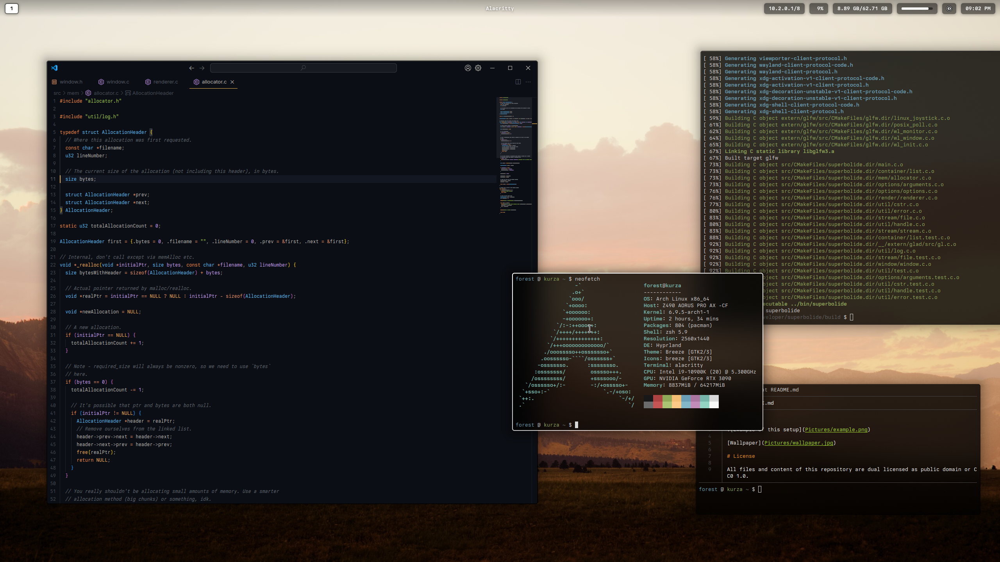

# dotfiles



[wallpapers](pictures/)

# using

add this to your `.zshrc`:
```
alias dotfiles='/usr/bin/git --git-dir="$HOME/.dotfiles/" --work-tree="$HOME"'
```

then, run these commands to create a local repository and add this one as an origin:

```
git init --bare ~/.dotfiles
dotfiles branch -m main
dotfiles remote add origin https://github.com/ForestKatsch/dotfiles.git
# (make sure you don't have any unstaged files)
dotfiles branch --set-upstream-to origin/main main
dotfiles pull
dotfiles config --local status.showUntrackedFiles no
```

from now on, run `dotfiles pull` to update.

# keybindings

- screenshotting (copies to the clipboard)
  - `print screen` screenshots the active display
  - `win + print screen` screenshots a selected window
  - `win + shift + print screen` screenshots a selected region

# hardware

there's no requirements to match the hardware; but some configuration options depend on hardware-specific settings that might not behave the same if not present.

- nVidia GPU (affects some Hyprland settings)
  - `DP-1` 2560x1440 @ 144 (LG 27GL83A-B)
  - `DP-2` 3840x2160 @ 60 (Samsung U28E510D)
  - `DP-3` Valve Index / VR headset
- Keychron K10 Pro, with [some keys remapped](hardware/keyboard/keychron-k10-pro-keymap.json) (notably, caps lock and ctrl are swapped)
- Logitech G502 X wireless mouse at 800 dpi (unfortunately, needs to be configured with G Hub on Windows)

# todo

- update to [Berkeley Mono v2](https://x.com/usgraphics/status/1872300684131115267) (aka TX-02)

# license

All files and contents of this repository are dual licensed as public domain or CC0 1.0. Feel free to attribute to Forest Katsch if you'd like, but it's not required.